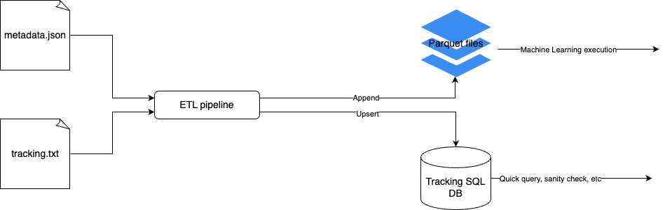

# SkillCorner ETL Process

## Problem Statement
Write an ETL process to store the data in formats to be used by the data science team.  It is up to you to determine what the format and schema should be based on what you anticipate the questions of the data science team will be.

## Design Overview
This ETL process is designed to be run either on scheduled basis, e.g. Daily or on demand. The first stea is data extraction from a pair of source file, match tracking text file and match metadata json file. The transformation step is to convert the data from document format to structured, columnar format around a number of entities. The final step is to load the data into two different datastores, a SQL database and parquet files. This design decision will be explained in the following sections.




## Data Extraction
Both match tracking data and metadata files are read to pandas dataframes. Pandas are dataframes are chosen due to its ease of use and versatility. The alternative is using Spark or Dask, which would be more suitable for larger scale data extraction that requires cluster of machines. However, the tracking data file is approximately 100 MB, which is well within capacity of pandas dataframe processing in a single machine. The metadata file is only 1.5 MB, which is also well within capacity.


## Data Transformation
The data transformation step is the most complex but most important step in thhe entire process. The goal is to transform the data from document format to structured, columnar format around a number of entities. I discovered five entities between tracking and metadata datasets. Three entities are derived from exploding/flattening the tracking data. They are:
* __Tracking__, which consists of tracking information nested in _data_ (_game_id_, _frame_, _track_id_, _trackable_object_, _is_visible_, _x_, _y_, and _z_ columns).
* __Possession__, which consists of possession nested information (_game_id, _group_, _trackable_object_ columns).
* __Frame__, which consists of the rest of pertinent information in the tracking dataset (_game_id_, _frame_, _image_corners_projection_, _period_, and _timestamp_in_seconds_ columns.)

Two entities are derived from the metadata file. They are:
* __Players__, which is player-related data under _players_ key, such as _game_id_, _trackable_object_, _start_time_, _player_role_, etc.
* __Metadata__, which consists of multiple entities, but does not directly relevant to answering Task 2 questions; entities such as _stadiums_, _teams_, _competitions_, etc.

During the transformation process, empty tracking data or empty frames are dropped altogether.

## Data Loading
The resulting dataframes are loaded into a SQL database as well as written into parquet files. They both follow the same schema; each entity is appended a SQL table, such as __track__ and a parquet file, such as __track.parquet__.
For this exercise, both set of datastores are generated in the current directory.

## Usage
The ETL process is implemented in Python 3 code, and organized into _etl.py_ module. The module is designed to be run as a script or as a library for cloud deployment pipeline. 
The script also comes with unit test under __tests__ folder, as well as some exploratory analysis under __notebooks__ folder. The library requirements are captured in __requirements.txt__ file, and can be installed using pip or anaconda.

To run the ETL process, create virtual environment with the requirements installed, and run the following command:
```python etl.py -m <match_metadata_file, e.g. 10000_metadata.json> -t <match_tracking_file, e.g. 10000_tracking.txt>```

To run the unit test, go into the __tests__ folder, and run the following command:
```pytest```

Sample output datasets are in CSV format under the __sample_output__ folder.

# Q&A
## Why did you choose this schema?
The RDBMS schema is a natural conversion from document format to structured, columnar format. The schema is also designed to be flexible and extensible, so that it can be easily adapted to future changes in the data source. Furthermore, the schema is designed to be easily identifiable and easy to query without complex joining/merging.

The architecture design serves several important purposes. First, having two datastores with parallel pipelines ensure redundancy; each can serve as backup for other (this is demonstrated in the Task 2 Jupyter notebook where it queries from both data stores). Second, having both SQL database and parquet files ensure flexibility and ease of uses for data scientists. Based on my experience, most data scientists are comfortable with SQL, and SQL database is a natural choice for data exploration. SQL is also great for frequent writing operation, not the least because of its ACID properties. However, parquet files performance are very useful for data scientists who want to apply Machine Learning algorithms that requires heavy data processing since parquet files are designed for distributed processing. Parquet files are also very efficient in storage and can be stored relatively cheaply in data warehouse such as AWS S3. The compute cost can vary depending on the use case for these two datastores and others.

Lastly, I choose pandas over PySpark for the ETL process because the data size is relatively small, and pandas is much easier to use and debug.

## What alternatives did you consider?
I considered using PySpark for the ETL process, but like explained above, pandas is suffice to handle the amount of dataset.
I also considered using MongoDB or other document databases as the datastore, but decided against it because the data is considered structured and relational. Document database also requires more complex querying and joining, and its performance is not as good as SQL.
ORC is a solid alternative to Parquet, but Parquet is more widely supported, including by Apache Spark, while ORC is natively supported for Hive.

### What are the trade offs in terms of running time, compute cost and storage cost?
The details regarding the trade offs are explained above. The design decision is based on short running time, relatively low compute cost, and highly efficient in storage.

### Are there any concerns with scale?
Everything is scalable and can be easily migrated to the cloud. The Sqlite database I use is appropriate for this proof-of-concept work but for production, I would choose to use PostgreSQL or MySQL for scalability. The parquet files can be stored in AWS S3, which is highly scalable. The ETL process can be easily deployed in cloud environment such as AWS SageMaker or AWS Lambda. If pandas that runs on a single machine is not sufficient, it can be easily converted to use Pandas API on PySpark, which I will demonstrate in the Task 2 Jupyter notebook.

### What might change if you were asked to merge this with event data (for example Statsbomb or WyScout)
The ETL process will be similar with additional transformation step to merge the event data with the tracking data based on the timestamp. The schema will also include event data with additional entities for event data-specific information. The data loading step will follow the same pattern with additional SQL tables and parquet files for event data entities.